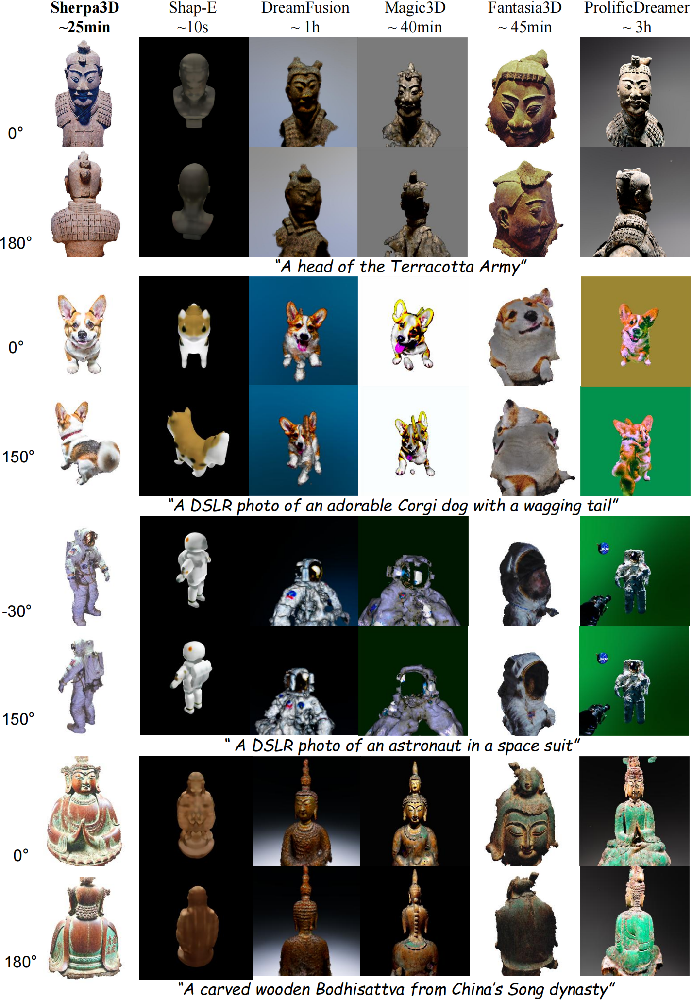

# Sherpa3D: Boosting High-Fidelity Text-to-3D Generation via Coarse 3D Prior

[**Paper**](https://arxiv.org/abs/2312.06655) | [**Project Page**](https://liuff19.github.io/Sherpa3D/) | [**Video**](https://liuff19.github.io/Sherpa3D/)

Official implementation of Sherpa3D: Boosting High-Fidelity Text-to-3D Generation via Coarse 3D Prior

[Fangfu Liu](https://liuff19.github.io/), Diankun Wu, [Yi Wei](https://weiyithu.github.io/), [Yongming Rao](https://raoyongming.github.io/), [Yueqi Duan](https://duanyueqi.github.io/)

The paper has been accepted by **CVPR 2024** 🔥.

<p align="center"> All Code will be released soon... 🏗️ 🚧 🔨</p>

Abstract: *Recently, 3D content creation from text prompts has demonstrated remarkable progress by utilizing 2D and 3D diffusion models. While 3D diffusion models ensure great multi-view consistency, their ability to generate high-quality and diverse 3D assets is hindered by the limited 3D data. In contrast, 2D diffusion models find a distillation approach that achieves excellent generalization and rich details without any 3D data. However, 2D lifting methods suffer from inherent view-agnostic ambiguity thereby leading to serious multi-face Janus issues, where text prompts fail to provide sufficient guidance to learn coherent 3D results. Instead of retraining a costly viewpoint-aware model, we study how to fully exploit easily accessible coarse 3D knowledge to enhance the prompts and guide 2D lifting optimization for refinement. In this paper, we propose **Sherpa3D**, a new text-to-3D framework that achieves high-fidelity, generalizability, and geometric consistency simultaneously. Specifically, we design a pair of guiding strategies derived from the coarse 3D prior generated by the 3D diffusion model: a structural guidance for geometric fidelity and a semantic guidance for 3D coherence. Employing the two types of guidance, the 2D diffusion model enriches the 3D content with diversified and high-quality results. Extensive experiments show the superiority of our Sherpa3D over the state-of-the-art text-to-3D methods in terms of quality and 3D consistency.*

<p align="center">
    
</p>


## Results

Qualitative comparisons with baseline methods across different views. All methods use *stabilityai/stable-diffsuion-2-1-base* for
fair comparison. We observe that baselines suffer from severe multi-face issues while Sherpa3D achieves better quality and 3D coherence.
<p align="center">
    
</p>


## BibTeX

```bibtex
@misc{liu2023sherpa3d,
      title={Sherpa3D: Boosting High-Fidelity Text-to-3D Generation via Coarse 3D Prior}, 
      author={Fangfu Liu and Diankun Wu and Yi Wei and Yongming Rao and Yueqi Duan},
      year={2023},
      eprint={2312.06655},
      archivePrefix={arXiv},
      primaryClass={cs.CV}
}
```
