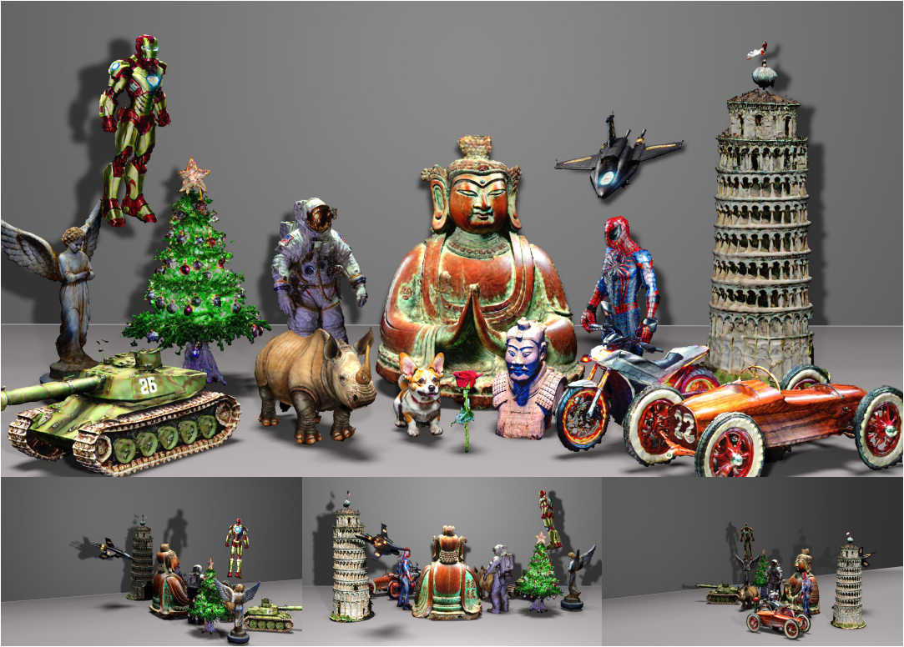

 # <p align="center"> <span style="font-weight: bold;">Sherpa3D</span>: Boosting High-Fidelity Text-to-3D Generation via Coarse 3D Prior </p>

 #####  <p align="center"> [Fangfu Liu<sup>1</sup>](https://liuff19.github.io/), Diankun Wu<sup>1</sup>, [Yi Wei<sup>1</sup>](https://weiyithu.github.io/), [Yongming Rao<sup>2</sup>](https://raoyongming.github.io/), [Yueqi Duan<sup>1</sup>](https://duanyueqi.github.io/)</p>

 ##### <p align="center"> <sup>1</sup>Tsinghua University, <sup>2</sup>BAAI</p>
 ##### <p align="center">  <span style="font-weight: bold;">CVPR (2024)</span></p>
 
#### <p align="center">[Paper](https://arxiv.org/pdf/2312.06655.pdf) | [ArXiv](https://arxiv.org/pdf/2312.06655) | [Project Page](https://liuff19.github.io/Sherpa3D/) | [Code](https://github.com/liuff19/Sherpa3D)</p>


Abstract: *Recently, 3D content creation from text prompts has demonstrated remarkable progress by utilizing 2D and 3D diffusion models. While 3D diffusion models ensure great multi-view consistency, their ability to generate high-quality and diverse 3D assets is hindered by the limited 3D data. In contrast, 2D diffusion models find a distillation approach that achieves excellent generalization and rich details without any 3D data. However, 2D lifting methods suffer from inherent view-agnostic ambiguity thereby leading to serious multi-face Janus issues, where text prompts fail to provide sufficient guidance to learn coherent 3D results. Instead of retraining a costly viewpoint-aware model, we study how to fully exploit easily accessible coarse 3D knowledge to enhance the prompts and guide 2D lifting optimization for refinement. In this paper, we propose **Sherpa3D**, a new text-to-3D framework that achieves high-fidelity, generalizability, and geometric consistency simultaneously. Specifically, we design a pair of guiding strategies derived from the coarse 3D prior generated by the 3D diffusion model: a structural guidance for geometric fidelity and a semantic guidance for 3D coherence. Employing the two types of guidance, the 2D diffusion model enriches the 3D content with diversified and high-quality results. Extensive experiments show the superiority of our Sherpa3D over the state-of-the-art text-to-3D methods in terms of quality and 3D consistency.*

<p align="center">
    
</p>

## Table of Contents
- [Table of Contents](#table-of-contents)
- [Installation](#installation)
- [Training](#training)
  - [Quick Start](#quick-start)
  - [Custom training](#custom-training)
- [Acknowledgement](#acknowledgement)
- [BibTex](#bibtex)

## Installation
1. Clone Sherpa3D.
```bash
git clone https://github.com/liuff19/Sherpa3D.git
cd Sherpa3D
```

2. Create the environment, here we show an example using conda. 
```bash
conda create -n Sherpa3D python=3.9
conda activate Sherpa3D 
```

3. Install PyTorch >= 1.12. We have tested on torch1.12.1+cu113.
```bash
pip install torch==1.12.1+cu113 torchvision==0.13.1+cu113 --extra-index-url https://download.pytorch.org/whl/cu113
```

4. Install dependencies:
```bash
pip install -r requirements.txt
```
5. Download finetuned shap-E model.
```bash
cd load/shapE-finetuned/
bash download.sh
```

6. (Optional) If you are experiencing unstable connections with Hugging Face, we suggest you downloading the guidance model you used to a local folder following [here](https://huggingface.co/docs/huggingface_hub/v0.14.1/guides/download#download-an-entire-repository) and [here](https://huggingface.co/docs/huggingface_hub/v0.14.1/guides/download#download-files-to-local-folder), and set `model_key` of the guidance and the prompt processor to the local path.

## Training
### Quick Start

We provide some scripts and pre-defined configs to automatically run the geometry modeling stage and appearance modeling stage. For a quick start, you can run:
```bash
# Prompt: A head of Terracotta Army
cd bash
bash terracotta_army_1gpu.sh 
```
```bash
# Prompt: A detailed and realistic 3D model of a vintage camera
cd bash
bash camera_4gpu.sh
```
We also provide scripts for some other prompts, which you can find in the "./bash" directory. The outputs will be saved in "./outputs/geometry" and "./outputs/appearance" respectively. 
### Custom training
1. To perform custom training, you need to create a config file first. We have provided some examples in the "./configs" directory.
2. After completing the configuration, you can start custom training. We provide the following two methods:
  - If you want to complete the training of both geometry and appearance in one go, please make sure your config files are named following the formats "xxx_geo.json" and "xxx_app.json", respectively. Then use the following commands to train:
```sh
cd bash
# using 1 GPU
general_1gpu xxx 
# using 4 GPU
general_4gpu xxx 
# using 8 GPU
general_8gpu xxx 
```
- If you want to train geometry and appearance respectively. You can use the following commands:
```sh
# Multi-GPU training (recommanded)
# Geometry modeling using 8 GPU 
python3 -m torch.distributed.launch --nproc_per_node=8 train.py --config path/to/your/config_geo/file
# Geometry modeling using 4 GPU
python3 -m torch.distributed.launch --nproc_per_node=4 train.py --config path/to/your/config_geo/file
# Appearance modeling using 8 GPU
python3 -m torch.distributed.launch --nproc_per_node=8 train.py --config path/to/your/config_app/file
# Appearance modeling using 4 GPU
python3 -m torch.distributed.launch --nproc_per_node=4 train.py --config path/to/your/config_app/file

# Single-GPU training
# Geometry modeling. 
python3 train.py --config path/to/your/config_geo/file
# Appearance modeling.
python3  train.py --config path/to/your/config_geo/file
```

## Acknowledgement
This repo benefits from [Fantasia3D](https://github.com/Gorilla-Lab-SCUT/Fantasia3D), [Threestudio](https://github.com/threestudio-project/threestudio), [Shap-E](https://github.com/openai/shap-e) and [Cap3d](https://github.com/crockwell/Cap3D). Thanks for their wonderful work.

## BibTex
```
@misc{liu2023sherpa3d,
      title={Sherpa3D: Boosting High-Fidelity Text-to-3D Generation via Coarse 3D Prior}, 
      author={Fangfu Liu and Diankun Wu and Yi Wei and Yongming Rao and Yueqi Duan},
      year={2023},
      eprint={2312.06655},
      archivePrefix={arXiv},
      primaryClass={cs.CV}
}
```
